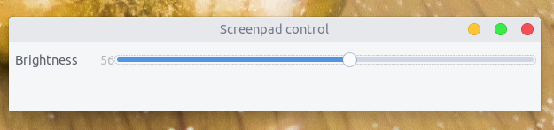

# ASUS Screenpad Control

This repository contains a version of the asus-wmi module with support for brightness control on secondary screens ("ScreenPad Plus") on ASUS Zenbook Duo notebooks. It also adds a few keys from the Zenbook Duo keyboard (Camera, /A, screen switch, toggle ScreenPad) so they can be mapped in your desktop environment. Credit goes to https://github.com/Plippo/asus-wmi-screenpad

Additinaly this provides a simple GUI application to control bightness with a slider.



## Build and Install

1. First you need to build the install the kernal module. For that please [read here](https://github.com/lakinduakash/asus-screenpad-control/blob/main/asus-wmi-screenpad/README.md)

2. Build gui application

  **Dependencies**
* gcc
* build-essential
* pkg-config
* gtk
* libgtk-3-dev

On Ubuntu or debian install dependencies by,

```bash
sudo apt install -y libgtk-3-dev build-essential gcc pkg-config make
```

Then build and install by executing following commands.

**Note:** `sudo make install` will install a init script and place binaries and desktop files under system directories. You can uninstall all of them by executing
`sudo make uninstall`


    # If you did't clone the repository yet
    git clone https://github.com/lakinduakash/asus-screenpad-control
    cd asus-screenpad-control
    
    #build binaries
    make
    
    #install
    sudo make install
    
## Uninstallation
    sudo make uninstall
    
## Running
You can run it from terminal or from application menu.

**Note:** When you use it first time without rebooting make sure to execute 

```sudo chmod a+w '/sys/class/leds/asus::screenpad/brightness'```.
Otherwise application may not have enough permission to control screenpad.

Run in terminal
 `screenpad-control`

## License

GNU GENERAL PUBLIC LICENSE
